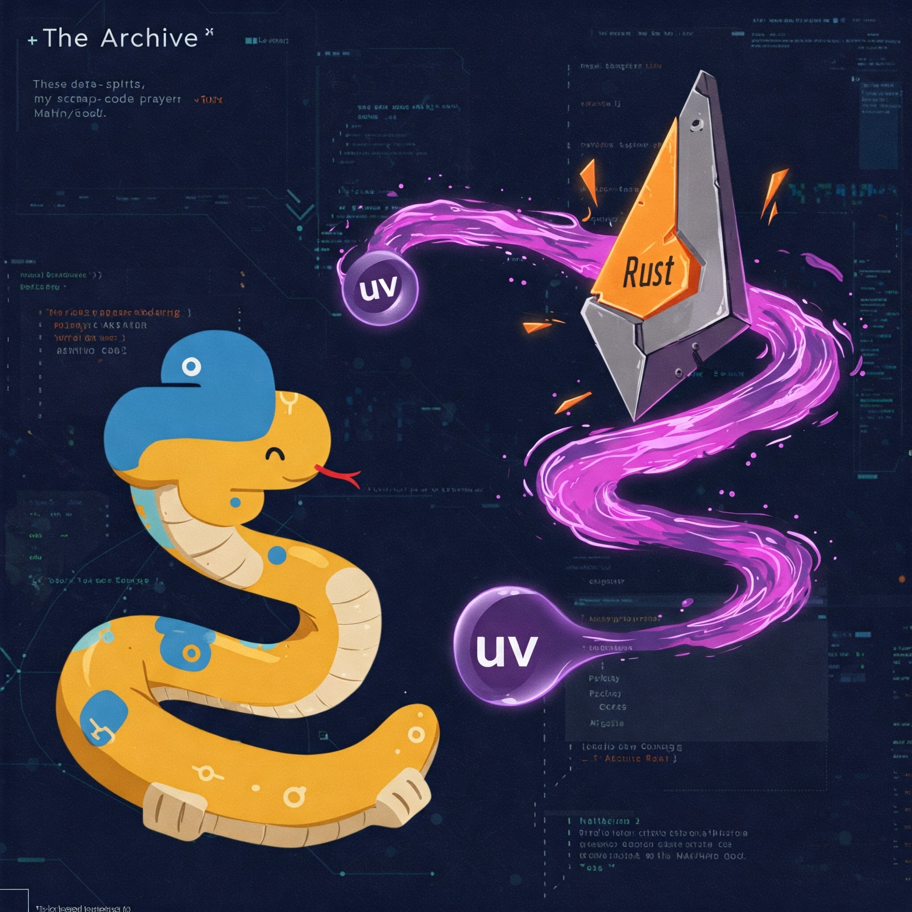

I've been noticed that my simple
 [python3 docker image](https://hub.docker.com/repository/docker/c1rno/python)
 with uv has unexpected amount of downloads, so, I descided to steal some
 traffic from original https://docs.astral.sh/uv/guides/integration/docker/
 to it page.

## What is it [uv](https://github.com/astral-sh/uv)?



Long story short -  it's fast-[rust](https://www.rust-lang.org/)
 python's [pip](https://pip.pypa.io/en/stable/) alternative. And `python3 -m
 venv ./venv` too and maybe more at time when you're reading it.

## So what?

So, don't use none of [one](https://hub.docker.com/repository/docker/c1rno/python)
 and [two](https://github.com/irr123/python-docker) and instead of it just do
 properly:

```bash
ARG BASE_IMAGE=python:3.13.2-slim-bookworm
ARG UV_VERSION=0.6.1

FROM ghcr.io/astral-sh/uv:$UV_VERSION AS uv_carrier
FROM $BASE_IMAGE AS builder

COPY --from=uv_carrier /uv /uvx /bin/
RUN uv venv /opt/venv
ENV PATH=/opt/venv/bin:$PATH \
    UV_COMPILE_BYTECODE=1  # optional optimization

COPY ./requirements.txt requirements.txt
RUN uv pip install -r requirements.txt

FROM $BASE_IMAGE

ENV PATH=/opt/venv/bin:$PATH \
    PYTHONUNBUFFERED=1

COPY --from=builder /opt/venv /opt/venv

COPY . /opt/app
WORKDIR /opt/app
```

## Conclusion

Personally I don't see any reason to spent time to setup uv locally, but on
 [CI](https://en.wikipedia.org/wiki/Continuous_integration) it safe a lot of
 time, don't waste it!
