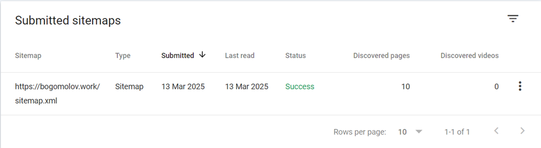
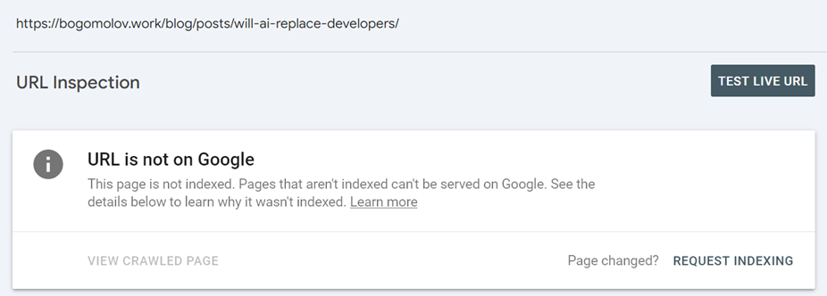
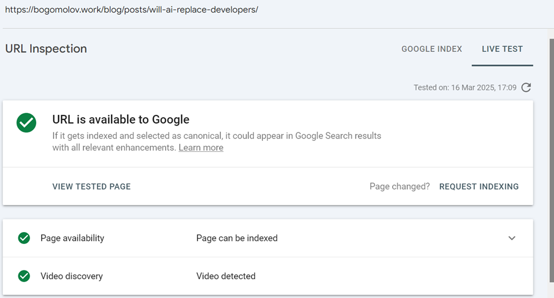
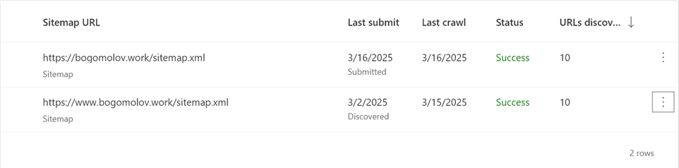
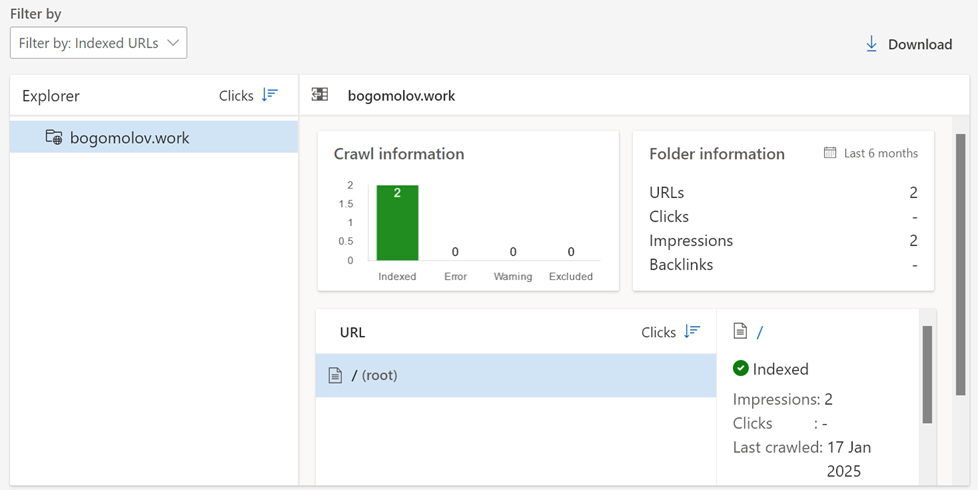
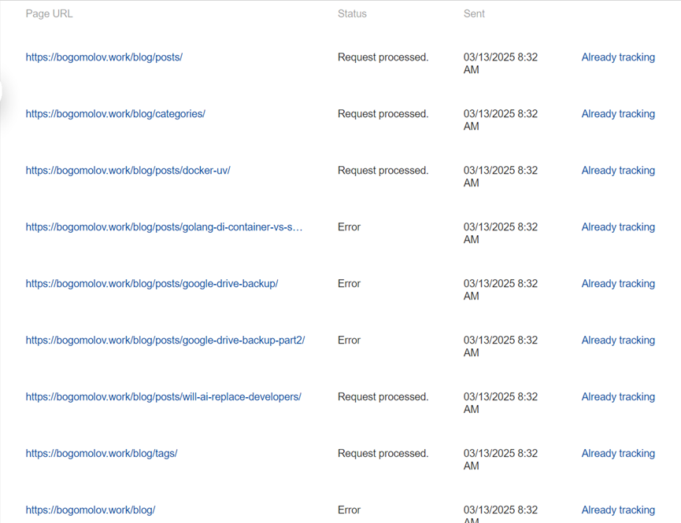

In this article I want to share my experience of using search engine consoles,
 continuing an idea from a recent [Telegram post](https://t.me/the_digital_lab/13).
 Maybe this could reduce frustration for someone, reassuring them that they're
 not alone - or even save them some time.


During the **~3 months** since my [domain](https://www.whois.com/whois/bogomolov.work)
 has been live I'm with
 [Google search console](https://search.google.com/search-console) and bit less
 with [Bing](https://www.bing.com/webmasters) and [Yandex
 webmaster-](https://webmaster.yandex.com)tools.


## Search engine relations

Initially, it's useful to understand that there aren't many truly independent
 players in this market. Here is what I know about it, based on public info:

- [Google](https://www.google.com/) has own index and reselling it to:
  - [StartPage](https://www.startpage.com/)
  - [Ecosia](https://www.ecosia.org/)
  - ...
- [Bing](https://www.bing.com/) has own index and reselling it to:
  - [Yahoo](https://www.yahoo.com/)
  - [Duckduckgo](https://duckduckgo.com/)
  - ...
- [Yandex](https://ya.ru/) has own index and I didn't find info about
  reselling it
- [Baidu](https://www.baidu.com/) has own index and I didn't find info about
  reselling it
- Newer AI-powered search engines have not publicly shared their indexing
  information
  - [Perplexity](https://www.perplexity.ai/)
  - [OpenAI](https://chatgpt.com/?hints=search)

What does this mean in practice? If your page gets incorrectly cached by Bing,
 fixing it can be difficult-especially since other search engines rely on
 Bing's index.


1. Outdated DuckDuckGo result
   https://duckduckgo.com/?q=bogomolov+Software+engineer+Consultant:
   
1. Current Google result
   https://www.google.com/search?q=bogomolov+software+engineer+consultant:
   

That was changed about month ago and still inconsistent.



## Common parts

Even if you haven't verified ownership of your site/domain, search engines will
 still scrape your index page. Yep, based on my experience, only index,
 they will not do [DFS](https://en.wikipedia.org/wiki/Depth-first_search).
 And probably will never returns to re-check was there updates or not. Letting
 you know.

To try to fix it you need to go to:

- [Google search console](https://search.google.com/search-console)
- [Bing webmasters](https://www.bing.com/webmasters)
- [Yandex webmaster](https://webmaster.yandex.com)
- Omitting Baidu and AI-powered search engines this time

And prove your site ownership, they provided different options, I
 chose domain records for all of them.


```bash
$ dig bogomolov.work TXT
...

;; ANSWER SECTION:
...
bogomolov.work.         300     IN      TXT     "yandex-verification: 7417053df139a332"
```


The next step is to provide a [sitemap.xml](/sitemap.xml) and
 (optionally) set up [robots.txt](/robots.txt); others are specific.

However, these processes are not without their issues.


## Google

[Sitemap.xml](/sitemap.xml) provides full list of pages with dates when it was
 updated, my one is properly autogenerates and validated by:
- Removing and then re-adding the sitemap helps to verify the number of indexed pages
- Yandex provides validator
- Other search engines

But in my experience it's never works, sometimes submitting new url
 directly thru UI helps, after several attempts and time. For example
 [last one]()
 from 2025-03-12, it was submitted manually



amount of discovered pages is rights, it contains new one, while

testing live url

shows that all right with it


Other issue is it constantly adds nonexistent and undeclared page
 with redirect, which is hilightted as not indexed.

And once more - they crawler crashed on my page which caused it to be dropped
 from the index. Strange, case neither Bing nor Yandex have such issue.
 Validation took three days, what would be if it was my main selling landing?

Unlike other search engines, Google does not provide specific suggestion.


## Bing

Most dunno indexer, I would even tell that it just broken.

Let's disregard its suggestions about to short page titles and descriptions


For example it rejected to index
 [/blog](/blog)-page, because it dislike title "_The Archive_", to short,
 thats why I needs to implement workaround and appending descriptions part if
 title too short.
In addition to title and index, it shames me for multiple `h1` on single
page and I fixed it (but okay-okay, here it was right).


because it just completely ignores any actions from webmaster.
Initially, likely upon domain registration, it indexes the site. However,
 it later detects a duplicate sitemap from the CNAME'd _www_ subdomain.



And all what it knows (yep, just [**/**](/), _outdated_ [**/**](/)):



...It has limits to add pages manually, 10 per day. Few times I
 exausted that limit, it takes few days, showing me "Not enough data",
 in almost all pages in console, after that time see previous about outdated
 [**/**](/).


## Yandex

Let me introduce to you simple metric to compare engines - how much pages are
 available in index:

|Query                                                             |  Google  |  Bing  |  Yandex |
|:-----------------------------------------------------------------|:--------:|:------:|:-------:|
|Software engineer & Consultant site:bogomolov.work                | ✅       | ❌     | ✅      |
|The Archive site:bogomolov.work                                   | ❌       | ❌     | ❌      |
|Python3 Dockerfile with uv site:bogomolov.work                    | ✅       | ❌     | ❌      |
|DI Container vs. Service Template (generator) site:bogomolov.work | ✅       | ❌     | ❌      |
|(Almost) Free Google Drive Backup site:bogomolov.work             | ❌       | ❌     | ❌      |
|Google Drive Backup Part 2 site:bogomolov.work                    | ✅       | ❌     | ❌      |
|Will AI Replace Developers? site:bogomolov.work                   | ❌       | ❌     | ❌      |
|Total                                                             | 4        | 0      | 1       |

In addition to that table Yandex has one more excuse, it sees both of:
- [(Almost) Free Google Drive Backup]()
- [Google Drive Backup Part 2]()

but intentionally excludes them from search due to their _Low-value or
 low-demand_ page classification.




## Conclusion

If even basic indexing is this unreliable, how can we trust search engines for
 business growth? AI-powered alternatives may soon change the game, making
 traditional SEO less relevant. It's going to be too risky to rely on search
 results and position on it. So, long story short, I don't see any reason to
 spend more time to SEO, better focus on another organic traffic source.
