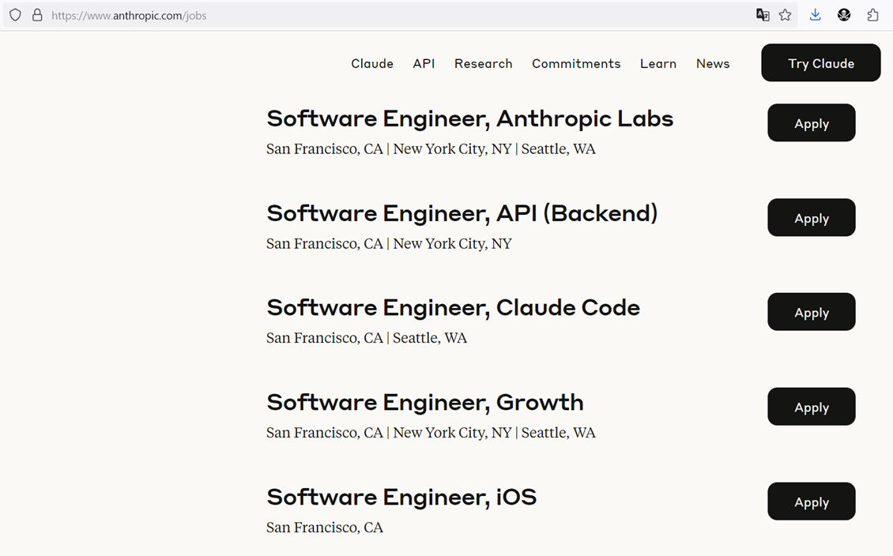

A common narrative from [OpenAI](https://openai.com/) and similar companies
 (previous hype was from [no-code-guys](https://www.nocode.tech/))
 suggests that the era of human developers is ending due to cost considerations,
 and that [AI](https://gemini.google.com/) will replace
 [us](https://en.wikipedia.org/wiki/Software_development#Workers) soon.

Check this talk from the CEO of [Anthropic](https://www.anthropic.com/),
 which occurred just one day before this article[^1]:



And examine their [actual hiring plans](https://www.anthropic.com/jobs)
 (Product, Infra, and Data Science). Notably, hiring for any senior or even
 staff position takes six months or more:

Comparing this with Anthropic's current size of about
 [700 employees](https://en.wikipedia.org/wiki/Anthropic), it reveals their
 plan for significant growth.., isn't it?

Draw your own conclusions. By the way, they primarily write code in [Go](https://go.dev/).

P.S. Pay close attention to Dario Amodei's final answer regarding what it means
 to be human. It's quite encouraging.

---
{data-content="footnotes"}

[^1]: Note how my annotations and the embedded YouTube video with timestamp work effectively.
