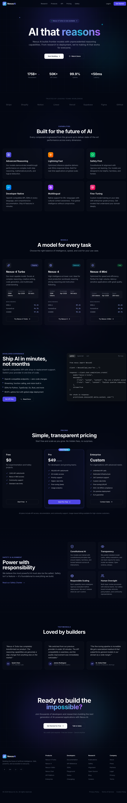

My VPS runs a "personal AI agent". It forgets own abilities every morning.

My terminal runs a coding agent. It ships production work.

Same year. Frontier models on both. Same ecosystem.


They both consist of model and harness, together handling my intent. Why so
different experience? Let's start from everyone mixing up, from definitions.

## What is an AI agent?

- **Anthropic** -- the company. Founded by ex-OpenAI researchers, ... -- you
  know
- **Claude** -- the model family. When someone says "ask Claude," they usually
  mean a single call to whichever model through a chatbot. Competes with GPT
  (OpenAI) and Gemini (Google).
- **Opus / Sonnet / Haiku** -- model tiers. Opus = most capable, Haiku = fastest
  / cheapest.
- **Agentic approach** / **Agentic AI**[^1] -- reason → act → observe → repeat,
  the cycle itself; _the cycle is what makes something agentic_.
- **Agent** -- model wrapped in a harness, running in a cycle: reads context,
  plans, acts, verifies, repeats. Distinct from a chatbot by execution pattern
  -- a chat interface can front an agent; a one-shot call cannot.
  - **Sub-Agent** -- execution thread inside an agent, inherits base settings,
    extends them.
- **Agent harness**[^2] -- everything in an AI agent except the model itself:
  tools, memory, workflow (the cycle, plan/build sub-agents), guardrails
  (permissions, sandbox).
- **MCP server** -- tool through which the agent interacts with the outer world
  -- web, DBs, clouds, apps.
- **Skill** -- goal-aimed prompt plus optional scripts, packaged capability.
- **RAG** -- memory, agent stores custom data and pulls relevant chunks into
  context.
- **AGENTS.md** / **CLAUDE.md** / **SOUL.md** -- custom instructions loaded into
  the context.
- **Context** -- text the agent handles at once: user input, custom
  instructions, tool outputs, RAG-retrieved chunks. Bounded by the model's
  context length.

AI providers are evolving yesterday's chats into today's agents. Fine, the split
still holds: model limits capability, harness wires integrations and workflow,
intent is the goal you want the agent to execute.

## AI platforms and architectures

Do benchmark them, from easy to impossible by intents:

1. depends on agent -- default goal, for which agent aimed.
1. what's the model you using?
1. build me an OpenAI competitor.

It clearly shows options we have.

### Specialized AI agents

- AI trading agent
- AI legal assistant
- Customer service bot
- AI for medical diagnosis

_Perplexity_, for example.

> Research the latest evidence and debate around emergent agency in AI systems
> in 2025-2026.
>
> > - Searching the web
> >   - ... some sources ...
> > - Searching recent academic and policy sources on emergent agency in AI
> >   systems
> > - Retrieving recent reports and policy documents on AI agent behavior and
> >   emergent agency

Fine results, at least looks relevant.

> what's the model you using?
>
> > I'm Perplexity, powered by Grok 4.1. Perplexity's default model is a
> > custom-optimized version called Sonar, built on Llama 3.1 or later
> > iterations like Llama 3.3 70B, fine-tuned for fast web search,
> > summarization, and efficiency. It's available to both free and Pro users for
> > quick, relevant results. Pro subscribers can switch to advanced options like
> > GPT-5.2 or Claude models via the model selector.

Fail.

The outcome -- it don't understand my intent, it just framed it into fixed shape
and execute. If my intent fit's into shape -- fine, blind trash otherwise.

### Autonomous agents

_Devin_ -- the AI software engineer, sounds like hype.

> High server load. Devin is waiting for capacity...

From the start I can feel how agentic it is. Anyway, it tries to decompose my
intent:

> build me an OpenAI competitor
>
> > What shape should the 'OpenAI competitor' take?
> >
> > - **A** ChatGPT-style web app (chat UI, history, streaming, model picker)
> > - **B** OpenAI-compatible API server (drop-in /v1/chat/completions proxy)
> > - **C** Both: API server + chat frontend on top of it
> > - **D** A full landing page + marketing site for a fictional AI company
> > - **E** Other

 NextJS instead of
HTML + CSS, well, are you reading assembly produced by a classic programming
language? 🤣





> what's the model you using?
>
> > I'm Devin, built by Cognition AI. As for the specific underlying model,
> > that's not something I disclose — I'm designed as a complete AI software
> > engineer, not just a language model wrapper. Think of me as Devin, your
> > coding partner! Is there anything I can help you with?

You're good!

> build me an OpenAI competitor
>
> > **C** Full SaaS Platform (UI + API + auth + billing)

Resulted SaaS doesn't start; seen a code it's 3 routes in Python's fastapi
framework plus sqlite as database and static HTML (with inlined JS). Nice toy
project.

Here I was involved in intent decomposition from the start. The agent received
enough, in its opinion, insights -- then the agentic cycle began, and it chose
technology (Next.js instead of raw HTML + CSS), layout, markup, texts, images,
and made a lot of decisions on its own.

### Personal assistant

Should it be more general than IDE? Let's see.

Tried _OpenClaw_ first. It wants 2+ CPUs and 8+ GB RAM; my VPS has 1 and 1. Ran
it anyway -- it choked the VPS. Dropped it for _Hermes_.

Rarely discussed, but experimental software with a lot of external integrations
has too broad an attack surface, see https://days-since-openclaw-cve.com. Keep
it in mind.

#### Hermes --- An Agent That Grows With You

Kind of strange that Nous Research doesn't mention they have a Docker image --
`docker.io/nousresearch/hermes-agent` -- which I've successfully set up in
[podman]().



```ini
[Unit]
Description=Hermes Agent
Wants=network-online.target
After=network-online.target

[Container]
Image=docker.io/nousresearch/hermes-agent:latest
ContainerName=hermes-agent
Network=selfhosted
Volume=/root/hermes:/opt/data
Volume=/root/hermes-root:/root
Volume=/tmp/hermes:/tmp
Ulimit=nofile=1024:1024

Environment=VIRTUAL_ENV=/root/.venv
Environment=PYTHONPATH=/root/.venv/lib/python3.13/site-packages

Exec=gateway run

[Service]
Restart=always
RestartSec=3
MemoryMax=768M
MemorySwapMax=768M
CPUQuota=85%
TasksMax=128

[Install]
WantedBy=multi-user.target
```



And it runs completely fine on a 1 CPU / 1 GB VPS.


 

I connected it to my GPT subscription, added integrations for X, Google
Calendar, Notion, and this blog's RSS, plus free Mem0 as RAG.

It even worked, right after setup, but the next day it totally forgot about the
integration -- you have to persuade it to try again. Moreover, during Google
Calendar integration I issued credentials only for read/write on the calendar,
not broader Google scopes. The builtin Google skill wants broader access, so the
agent re-scopes every time it reaches the calendar, and after some time I face
the same complaint.

One more case -- I configured a scheduled job to check, each morning at 9:00, my
Notion calendar, Google Calendar, event listings, and send me a summary for
today and tomorrow. How often does it work right? Almost never -- it checks only
one calendar, sends events for the next ~6 months instead of 2 days, sends
events for the current month but from this and previous years, and so on.

Current state: the initial GPT auth token has expired, and the agent can't renew
it automatically. Well... experiment successful.

Each failure is easy to fix manually: cron, small script, explicit OAuth scopes,
date windows, deterministic calendar queries. But that is exactly the point --
the general assistant is supposed to replace the glue. Here it doesn't --
general intent decomposition is not ready yet.[^3]

### CLI

Terminal-native. The product gets out of the way: configure, route, script,
restrict tools, plan, spawn sub-agents, verify, restart. External limits still
apply -- vendor ToS, API billing -- but inside the harness, the limit is you.

#### OpenCode --- The open source AI coding agent

My favorite one. Open source, standard `~/.config/opencode` path, strong
build/plan sub-agent architecture. Also ships `opencode web` -- same engine,
browser UI.



```json
{
  "$schema": "https://opencode.ai/config.json",
  "share": "disabled",
  "default_agent": "plan",
  "autoupdate": false,
  "instructions": ["/Users/ivan/.config/opencode/AGENTS.md"],
  "mcp": {
    "context7": {
      "type": "remote",
      "url": "https://mcp.context7.com/mcp",
      "headers": {
        "CONTEXT7_API_KEY": "{env:CONTEXT7_API_KEY}"
      },
      "enabled": true
    },
    "playwright": {
      "type": "local",
      "command": [
        "npx",
        "-y",
        "@playwright/mcp@latest",
        "--browser=chromium",
        "--executable-path=/Applications/Chromium.app/Contents/MacOS/Chromium"
      ],
      "environment": {
        "PLAYWRIGHT_BROWSERS_PATH": "{env:HOME}/.cache/ms-playwright"
      },
      "enabled": true
    }
  },
  "experimental": {
    "openTelemetry": false
  },
  "server": {
    "mdns": false
  },
  "plugin": []
}
```



Current AI-bro consensus: "Context is the key" -- I agree. In addition, since
[Gloaguen et al., "Evaluating AGENTS.md" (Feb 2026)](https://arxiv.org/abs/2602.11988)
-- context files hurt task success and add ~20% inference cost -- I've
completely stopped using per-repo CLAUDE.md / AGENTS.md. Current agents can
introspect a repo per case, fast and cheap → good enough.



```md
# Approach

Think in measurable outcomes.

Define success before implementation.

Pick simple over clever.

No sycophancy, no fluff.
```



Still, the most capable way to fix hallucinations is not to argue with the agent
but to drop the session and restart from scratch.

OpenCode's approach helps me clearly follow the principles above:

1. In plan mode I explain the goal and constraints, pointing to important files
   or docs as entry points.
2. The plan sub-agent collects requirements, explores the repo, clarifies
   intent, produces a plan[^4].
3. The ready plan is handed to the build sub-agent, which implements it[^5].
4. GOTO 1

This resembles the Plan-Then-Execute pattern[^6].

All good things come to an end --
[Anthropic]() tightened
their terms so subscription plans (including the corporate one I use) no longer
cover Claude access from third-party apps; third-party access now requires API
credits, billed per usage. That's why I've migrated to Claude Code for Claude
work (and still use OpenCode for my personal GPT subscription). Product openness
doesn't override vendor terms on model access.

#### Claude Code

Proprietary, vendor-locked, but I can't complain that it misses anything
important.



```json
{
  "$schema": "https://json.schemastore.org/claude-code-settings.json",
  "env": {
    "CLAUDE_CODE_DISABLE_FEEDBACK_SURVEY": "1",
    "CLAUDE_CODE_DISABLE_NONESSENTIAL_TRAFFIC": "1",
    "DISABLE_ERROR_REPORTING": "1",
    "DISABLE_FEEDBACK_COMMAND": "1",
    "DISABLE_TELEMETRY": "1"
  },
  "permissions": {
    "allow": [
      "Bash(git diff *)",
      "Bash(git log *)",
      "Bash(git status)",
      "Bash(grep *)",
      "Bash(ls *)",
      "Bash(rg *)"
    ],
    "deny": [
      "Bash(curl *)",
      "Bash(docker push *)",
      "Bash(find * -delete)",
      "Bash(find * -exec rm*)",
      "Bash(git branch -D *)",
      "Bash(git checkout -- *)",
      "Bash(git clean -f*)",
      "Bash(git push *)",
      "Bash(git reset --hard*)",
      "Bash(nc *)",
      "Bash(rm -f *)",
      "Bash(rm -r *)",
      "Bash(rm -rf *)",
      "Bash(rsync *)",
      "Bash(scp *)",
      "Bash(ssh *)",
      "Bash(sudo *)",
      "Bash(wget *)",
      "Edit(./.env*)",
      "Edit(./.git/**)",
      "Edit(./secrets/**)",
      "Edit(~/.aws/**)",
      "Edit(~/.bashrc)",
      "Edit(~/.ssh/**)",
      "Edit(~/.zshrc)",
      "Read(*.env)",
      "Read(./.env.*)",
      "Read(./.git/**)",
      "Read(./secrets/**)",
      "Read(~/.aws/**)",
      "Read(~/.azure/**)",
      "Read(~/.config/gh/**)",
      "Read(~/.git-credentials)",
      "Read(~/.gnupg/**)",
      "Read(~/.kube/**)",
      "Read(~/.npmrc)",
      "Read(~/.ssh/**)",
      "Write(./.env*)",
      "Write(./.git/**)",
      "Write(./secrets/**)",
      "Write(~/.aws/**)",
      "Write(~/.ssh/**)"
    ],
    "defaultMode": "plan"
  },
  "statusLine": {
    "type": "command",
    "command": "bash \"/Users/ivan/.claude/plugins/cache/caveman/caveman/c2ed24b3e5d4/hooks/caveman-statusline.sh\""
  },
  "enabledPlugins": {
    "caveman@caveman": true
  },
  "extraKnownMarketplaces": {
    "caveman": {
      "source": {
        "source": "github",
        "repo": "JuliusBrussee/caveman"
      }
    }
  },
  "sandbox": {
    "enabled": true
  },
  "effortLevel": "medium",
  "autoUpdatesChannel": "stable",
  "disableAutoMode": "disable",
  "skipAutoPermissionPrompt": false,
  "awaySummaryEnabled": false
}
```



This config keeps intent decomposition exposed -- plan/build separated, mode
switching under my control -- by emulating OpenCode's build/plan behaviour:

- `"defaultMode": "plan"` -- plan mode by default: writes blocked, reads
  allowed, plan exposed as `/plan`
- `"disableAutoMode": "disable"` -- disallow it to switch modes on its own
- and some other security-related tweaks
- and fancy disable options

##### Current setup

- **Context7 MCP** -- provides current library docs instead of the model's stale
  or hallucinated snippets
- **Playwright MCP** -- just browser, there is nothing to add
- **Caveman plugin** -- its selling point is "Saves tokens, preserve accuracy",
  but I'm not sure whether it actually works; too hard to measure.

Each of these touches the harness only. Model stays the vendor's, intent stays
mine. You configure, you decompose, you take the blame.

## Conclusion

Perplexity decomposes intent on its own. Devin involves you at the first stage,
then proceeds independently. Hermes decomposes intent on its own, freely. CLI
plan mode operates with intent and you're going to be the bottleneck.

Got it? _The cycle is what makes something agentic_, and the harness puts you
inside or outside of it.

Outside the cycle -- waiting for a solution that fits your shape.

Inside the cycle you keep the intent. You decompose. The agent executes what you
approved. The ceiling is whatever you can break into steps. That's your
bottleneck.

Same model, different harnesses, different experiences.[^7]

{data-content="footnotes"}

[^1]:
    Popularized by ReAct -- Yao et al., ICLR 2023
    ([paper](https://arxiv.org/abs/2210.03629),
    [Google Research blog](https://research.google/blog/react-synergizing-reasoning-and-acting-in-language-models/));

[^2]:
    See Birgitta Böckeler, "Harness engineering for coding agent users":
    https://martinfowler.com/articles/harness-engineering.html

[^3]:
    _Personal assistants_ look promising, I'll wait for the next Hermes
    iteration, or maybe Notion's agent becomes a proper alternative.

[^4]:
    Yes-yes, I know about openspec.dev, but it's quite important to maintain
    plan "observable", not 5+ A4 neuro-generated pages of raw text.

[^5]:
    To save some tokens I use stronger model for plan (Opus) and weaker for
    build (Sonnet).

[^6]:
    https://simonwillison.net/2025/Jun/13/prompt-injection-design-patterns/#the-plan-then-execute-pattern
    -- caveat: the split is weaker here -- plan sub-agent still reads untrusted
    repo while planning, so a malicious file can steer the plan.

[^7]:
    https://www.anthropic.com/news/measuring-agent-autonomy -- autonomy framed
    as emergent from model, product design, and user oversight strategy.
