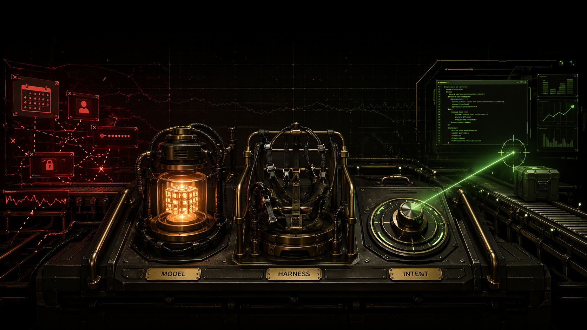
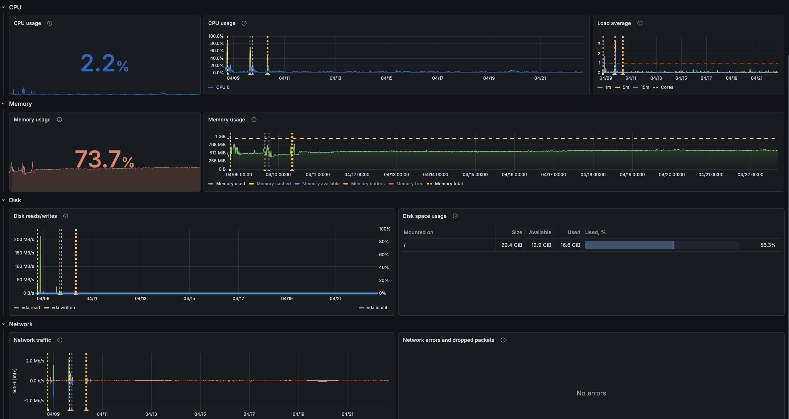

My VPS runs a "personal AI agent". It forgets its own abilities every morning.

My terminal runs a coding agent. It ships production work.

Same year. Frontier models on both. Same ecosystem.



They both consist of a model and a harness, together handling my intent. Why
such a different experience? Start with the thing everyone mixes up:
definitions.

## What is an AI agent?

- **Anthropic** -- the company. Founded by ex-OpenAI researchers, ... -- you
  know
- **Claude** -- the model family. When someone says "ask Claude," they usually
  mean a single call to whichever model through a chatbot. Competes with GPT
  (OpenAI) and Gemini (Google).
- **Opus / Sonnet / Haiku** -- model tiers. Opus = most capable, Haiku = fastest
  / cheapest.
- **Agentic approach** / **Agentic AI**[^1] -- reason → act → observe → repeat,
  the loop itself; _the loop is what makes something agentic_.
- **Agent** -- model wrapped in a harness, spins in a loop: reads context,
  plans, acts, verifies, repeats. Distinct from a chatbot by execution pattern
  -- a chat interface can front an agent; a one-shot call cannot.
  - **Sub-Agent** -- execution thread inside an agent, inherits base settings,
    extends them.
- **Agent harness**[^2] -- everything in an AI agent except the model itself:
  tools, memory, workflow (the loop, plan/build sub-agents), guardrails
  (permissions, sandbox).
- **MCP server** -- tool through which the agent interacts with the outer world
  -- web, DBs, clouds, apps.
- **Skill** -- goal-aimed prompt plus optional scripts, packaged capability.
- **RAG** -- memory, agent stores custom data and pulls relevant chunks into
  context.
- **AGENTS.md** / **CLAUDE.md** / **SOUL.md** -- custom instructions loaded into
  the context.
- **Context** -- text the agent handles at once: user input, custom
  instructions, tool outputs, RAG-retrieved chunks. Bounded by the model's
  context length.

Providers are wrapping yesterday's chats in agent loops -- execution pattern
flips, the chat UI stays. Same split still holds: model caps capability, harness
wires integrations and workflow -- and intent has to be decomposed into pieces
the agent can actually handle. Who does the decomposition is the next question.

## AI platforms and architectures

Three families competing for "AI agent" today. Same lens for each: who owns
intent decomposition -- the specialized harness, the personal assistant, or you?

### Specialized AI agents

- AI trading agent
- AI legal assistant
- Customer service bot
- AI for medical diagnosis

Same product shape: narrow task, fixed workflow, integrations hidden behind the
UI.

_Perplexity_ is the research/search version of that shape.

> Research the latest evidence and debate around emergent agency in AI systems
> in 2025-2026.
>
> > - Searching the web
> >   - ... some sources ...
> > - Searching recent academic and policy sources on emergent agency in AI
> >   systems
> > - Retrieving recent reports and policy documents on AI agent behavior and
> >   emergent agency

Fine results, at least looks relevant.

> what's the model you using?
>
> > I'm Perplexity, powered by Grok 4.1. Perplexity's default model is a
> > custom-optimized version called Sonar, built on Llama 3.1 or later
> > iterations like Llama 3.3 70B, fine-tuned for fast web search,
> > summarization, and efficiency. It's available to both free and Pro users for
> > quick, relevant results. Pro subscribers can switch to advanced options like
> > GPT-5.2 or Claude models via the model selector.

Fail. It understood the surface intent -- answer a product-stack question -- but
the product owned routing and context. I had no way to inspect which model
routed the answer, which metadata it saw, or why it mixed Grok, Sonar, and Llama
into one pile.

The outcome -- specialized harness frames intent into its fixed shape. When that
frame fits, you get a clean research answer. When the frame itself is wrong, you
get confident product salad and no useful control surface.

### Personal assistant

Tried _OpenClaw_ first. It wants 2+ CPUs and 8+ GB RAM; my VPS has 1 and 1. Ran
it anyway -- it choked the VPS. Dropped it for _Hermes_.

Rarely discussed, but experimental software with a lot of external integrations
has too broad an attack surface, see https://days-since-openclaw-cve.com. Keep
it in mind.

#### Hermes --- An Agent That Grows With You

Kind of strange that Nous Research doesn't mention they have a Docker image --
`docker.io/nousresearch/hermes-agent` -- which I've successfully set up in
[podman]().



```ini
[Unit]
Description=Hermes Agent
Wants=network-online.target
After=network-online.target

[Container]
Image=docker.io/nousresearch/hermes-agent:latest
ContainerName=hermes-agent
Network=selfhosted
Volume=/root/hermes:/opt/data
Volume=/root/hermes-root:/root
Volume=/tmp/hermes:/tmp
Ulimit=nofile=1024:1024

Environment=VIRTUAL_ENV=/root/.venv
Environment=PYTHONPATH=/root/.venv/lib/python3.13/site-packages

Exec=gateway run

[Service]
Restart=always
RestartSec=3
MemoryMax=768M
MemorySwapMax=768M
CPUQuota=85%
TasksMax=128

[Install]
WantedBy=multi-user.target
```



And it runs completely fine on a 1 CPU / 1 GB VPS.


 

I connected it to my GPT subscription, added integrations for X, Google
Calendar, Notion, and this blog's RSS, plus free Mem0 as RAG.

It even worked, right after setup, but the next day it totally forgot about the
integration -- you have to persuade it to try again.

OAuth failed in a different way. During Google Calendar integration I issued
credentials only for read/write on the calendar, not broader Google scopes. The
builtin Google skill wants broader access, so the agent re-requests broader
scopes every time it touches the calendar, and eventually the auth flow breaks
again.

One more case -- I configured a scheduled job to check, each morning at 9:00, my
Notion calendar, Google Calendar, event listings, and send me a summary for
today and tomorrow. How often does it work right? Almost never -- it checks only
one calendar, sends events for the next ~6 months instead of 2 days, sends
events for the current month but from this and previous years, and so on.

Current state: the initial GPT auth token has expired, and the agent can't renew
it automatically. Well... experiment successful.

Each failure is easy to fix manually: cron, small script, explicit OAuth scopes,
date windows, deterministic calendar queries. But that is exactly the point --
the general assistant is supposed to replace the glue. Here it doesn't. The
failure is not the model. The harness decomposes intent badly, and the UI
doesn't expose decomposition early enough to fix it.[^3]

### CLI

Terminal-native, actively evolving. Everything in your hands -- only vendor ToS
can limit you.

#### OpenCode --- The open source AI coding agent

My favorite one. Open source, standard `~/.config/opencode` path, strong
build/plan sub-agent architecture. Also ships `opencode web` -- same engine,
browser UI.



```json
{
  "$schema": "https://opencode.ai/config.json",
  "autoupdate": false,
  "default_agent": "plan",
  "share": "disabled",
  "snapshot": false,
  "instructions": ["/Users/ivan/.config/opencode/AGENTS.md"],
  "mcp": {
    "context7": {
      "type": "remote",
      "url": "https://mcp.context7.com/mcp",
      "headers": {
        "CONTEXT7_API_KEY": "{env:CONTEXT7_API_KEY}"
      },
      "enabled": true
    },
    "playwright": {
      "type": "local",
      "command": [
        "npx",
        "-y",
        "@playwright/mcp@latest",
        "--browser=chromium",
        "--executable-path=/Applications/Chromium.app/Contents/MacOS/Chromium"
      ],
      "environment": {
        "PLAYWRIGHT_BROWSERS_PATH": "{env:HOME}/.cache/ms-playwright"
      },
      "enabled": true
    },
    "claude": {
      "type": "local",
      "command": ["claude", "mcp", "serve"],
      "enabled": false
    }
  },
  "experimental": {
    "openTelemetry": false
  },
  "server": {
    "mdns": false
  },
  "plugin": []
}
```



Current AI-bro consensus: "Context is the key" -- I agree, context engineering
pwnd [prompt engineering]().

Even more, after
[Gloaguen et al., "Evaluating AGENTS.md" (Feb 2026)](https://arxiv.org/abs/2602.11988)
-- generated agent context files hurt task success and add ~20% inference cost
-- I've stopped keeping per-repo CLAUDE.md / AGENTS.md files full of paths,
framework summaries, and obvious project descriptions. Current agents can
inspect a repo per case, fast and cheap enough. Put only what they cannot infer
from code: constraints, preferences, dangerous commands, external contracts.



```md
# Approach

Clarify unclear inputs; do not invent context

Define measurable outcomes before implementation

Frame contradictions, don't compromise them

Pick simple over clever

Reuse what's in the system

Be brief, no sycophancy, no fluff

## Environment

There is no `gh` CLI command

Use `rg` instead of grep
```



Still, the most reliable way to fix hallucinations is not to argue with the
agent but to drop the session and restart from scratch.

OpenCode's approach helps me clearly follow the principles above:

1. In plan mode I explain the goal and constraints, pointing to important files
   or docs as entry points.
2. The plan sub-agent collects requirements, explores the repo, clarifies
   intent, produces a plan[^4].
3. The ready plan is handed to the build sub-agent, which implements it[^5].
4. GOTO 1

In plan mode, the harness exposes decomposition before execution. At that point,
the limit is you: how clearly you can split intent into steps.

This resembles the Plan-Then-Execute pattern[^6].

#### Claude Code

I migrated Claude work to Claude Code after Anthropic restricted third-party
Claude access to API credits[^7]; OpenCode still runs my GPT subscription.

Proprietary, vendor-locked, but I can't complain that it misses anything
important.



```json
{
  "$schema": "https://json.schemastore.org/claude-code-settings.json",
  "env": {
    "CLAUDE_CODE_DISABLE_FEEDBACK_SURVEY": "1",
    "CLAUDE_CODE_DISABLE_NONESSENTIAL_TRAFFIC": "1",
    "DISABLE_ERROR_REPORTING": "1",
    "DISABLE_FEEDBACK_COMMAND": "1",
    "DISABLE_TELEMETRY": "1"
  },
  "permissions": {
    "allow": [
      "Bash(git diff *)",
      "Bash(git log *)",
      "Bash(git status)",
      "Bash(grep *)",
      "Bash(ls *)",
      "Bash(rg *)"
    ],
    "deny": [
      "Bash(curl *)",
      "Bash(docker push *)",
      "Bash(find * -delete)",
      "Bash(find * -exec rm*)",
      "Bash(git branch -D *)",
      "Bash(git checkout -- *)",
      "Bash(git clean -f*)",
      "Bash(git push *)",
      "Bash(git reset --hard*)",
      "Bash(nc *)",
      "Bash(rm -f *)",
      "Bash(rm -r *)",
      "Bash(rm -rf *)",
      "Bash(rsync *)",
      "Bash(scp *)",
      "Bash(ssh *)",
      "Bash(sudo *)",
      "Bash(wget *)",
      "Edit(./.env*)",
      "Edit(./.git/**)",
      "Edit(./secrets/**)",
      "Edit(~/.aws/**)",
      "Edit(~/.bashrc)",
      "Edit(~/.ssh/**)",
      "Edit(~/.zshrc)",
      "Read(*.env)",
      "Read(./.env.*)",
      "Read(./secrets/**)",
      "Read(~/.aws/**)",
      "Read(~/.azure/**)",
      "Read(~/.config/gh/**)",
      "Read(~/.git-credentials)",
      "Read(~/.gnupg/**)",
      "Read(~/.kube/**)",
      "Read(~/.npmrc)",
      "Read(~/.ssh/**)",
      "Write(./.env*)",
      "Write(./.git/**)",
      "Write(./secrets/**)",
      "Write(~/.aws/**)",
      "Write(~/.ssh/**)"
    ],
    "defaultMode": "plan"
  },
  "enabledPlugins": {},
  "sandbox": {
    "enabled": true,
    "excludedCommands": ["git"]
  },
  "effortLevel": "high",
  "awaySummaryEnabled": false,
  "autoUpdatesChannel": "stable",
  "disableAutoMode": "disable",
  "theme": "light",
  "skipAutoPermissionPrompt": false
}
```



This config reaches the same control goal I like in OpenCode: decomposition
stays visible, writes stay gated, mode switching stays under my control:

- `"defaultMode": "plan"` -- plan mode by default: writes blocked, reads
  allowed, plan exposed as `/plan`
- `"disableAutoMode": "disable"` -- no autonomous mode switching
- `"sandbox.enabled": true` plus a `permissions.deny` list for `rm -rf`,
  `git push`, `sudo`, `~/.ssh/**`, etc.
- telemetry off: `DISABLE_TELEMETRY=1`, `DISABLE_FEEDBACK_COMMAND=1`,
  `DISABLE_ERROR_REPORTING=1`, `awaySummaryEnabled: false`

##### Current setup

- **Context7 MCP** -- provides actual library docs instead of the model's stale
  or hallucinated snippets
- **Playwright MCP** -- just browser, there is nothing to add
- **Caveman plugin** -- its selling point is "Saves tokens, preserve accuracy",
  but I'm not sure whether it actually works; needs to measure.[^8]

Each of these touches the harness only. Model stays the vendor's, intent stays
mine.

## Conclusion

Perplexity frames intent into its fixed shape. Hermes decomposes intent on its
own, without you. CLI plan mode operates on intent -- you're the bottleneck.

_The loop is what makes something agentic_, and the harness puts you inside or
outside of it.

Outside the loop: wait for a solution that fits your intent's shape.

Inside the loop: keep the intent, decompose it, approve execution. The ceiling
is whatever you can break into steps.

Same year. Same frontier models. Humans still hold the loop. That is the
autonomy that emerges today.[^9]

{data-content="footnotes"}

[^1]:
    Popularized by ReAct -- Yao et al., ICLR 2023
    ([paper](https://arxiv.org/abs/2210.03629),
    [Google Research blog](https://research.google/blog/react-synergizing-reasoning-and-acting-in-language-models/)).

[^2]:
    See Birgitta Böckeler, "Harness engineering for coding agent users":
    https://martinfowler.com/articles/harness-engineering.html.

[^3]:
    _Personal assistants_ look promising, I'll wait for the next Hermes
    iteration, or maybe Notion's agent becomes a proper alternative.

[^4]:
    Yes-yes, I know about openspec.dev, but it's quite important to maintain
    plan "observable", not 5+ A4 neuro-generated pages of raw text.

[^5]:
    To save some tokens I use stronger model for plan (Opus) and weaker for
    build (Sonnet).

[^6]:
    https://simonwillison.net/2025/Jun/13/prompt-injection-design-patterns/#the-plan-then-execute-pattern
    -- caveat: the split is weaker here -- plan sub-agent still reads untrusted
    repo while planning, so a malicious file can steer the plan.

[^7]:
    [Anthropic]()
    tightened terms -- subscription plans (including the corporate one I use) no
    longer cover Claude access from third-party apps; third-party access now
    requires per-usage API credits.

[^8]:
    Caveman vs "be brief",
    https://www.maxtaylor.me/articles/i-benchmarked-caveman-against-two-words.

[^9]:
    [Agent autonomy](https://www.anthropic.com/news/measuring-agent-autonomy)
    framed as emergent from model behavior, product design, and user oversight
    strategy.
