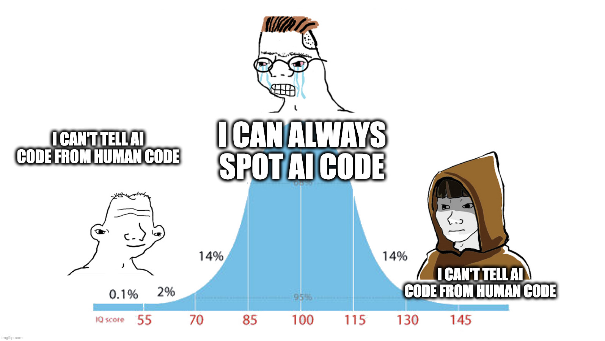

I spot AI code in PRs to repos I know. Usually it means nothing. Sometimes it
annoys me. Like recognizing a colleague’s style. But a colleague learns; an
agent needs an external gate saying "don't do it this way".

## If something exists, I could measure it

I wanted a reproducible signature to work with. Started from the observation I
already had: AI code looks overengineered to me. The plan was to compute target
metrics over time/commits and watch the curve bend around agent adoption.

I tried cyclomatic complexity, cognitive complexity, max nesting, conditions per
entity, and call stack depth.

The first snag was size. Complexity tracked SLOC almost one to one. So I
normalized everything on SLOC and kept looking.

Then added methods and functions per entity, entities per API method, entities
per package, dependency count, edges in the dependency graph, and error handling
density. About 280 metrics in all with their pairwise correlations.

I found no anomalies outside statistical error. Same for public repos and my
private ones.

### The explanation I couldn't shake

As per my understanding, a model emits roughly the mean of its training
distribution, while each human deviates from that mean. The means land on top of
each other, and the statistic goes quiet.

If that's what happened, comparing AI with human code hides the signal. I would
need to compare it with one specific person instead, but I don't have enough
single-author code to run that test.

## The public papers

The process did one useful thing: it taught me the proper questions, and those
led me to people who had already run the measurements.

1. [A Large-Scale Comprehensive Measurement of AI-Generated Code in Real-World Repositories](https://arxiv.org/abs/2603.27130)
2. [Not All Agents Are Equal: Code Quality and Post-Merge Maintenance Across Five Autonomous Coding Agents in the Wild](https://arxiv.org/abs/2609.17598)
3. [Human-Written vs. AI-Generated Code: A Large-Scale Study of Defects, Vulnerabilities, and Complexity](https://arxiv.org/abs/2508.21634)

These papers do find differences:

- **raw** AI-involved code is "more comment-heavy, less cross-file reused, ..."
  - these differences disappear in real-world repos (my guess: AGENTS.md
    customizations, linters and formatters, plus review)
- The stronger signal: AI-involved commits are smaller and more localized.
  - which I didn't measure and don't care about

The papers also add an angle I missed: vendors differ from each other. Which
literally means there is no common signature.

_Open niche:_ no one tests a single vendor against different AGENTS.md files and
related tunings. My bet: another layer of tuning splits the signature again.

## Conclusion

No general signature. Curiosity satisfied.

Referring to my original annoyance, looks like there is only one way to handle
it automatically: write dedicated static checkers to prevent specific patterns.
