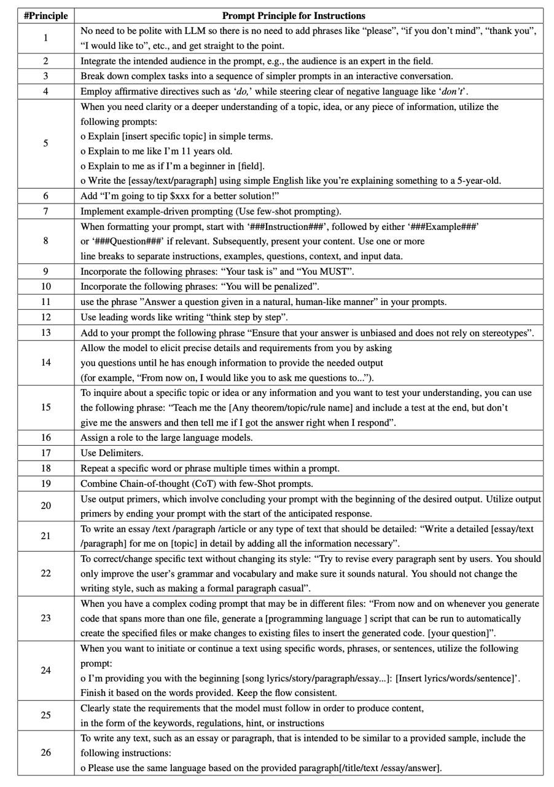
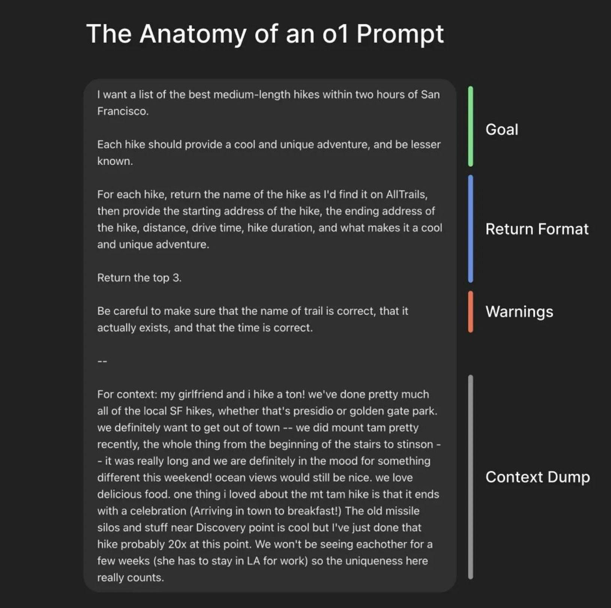

Cursor and some other
[prompts](https://github.com/x1xhlol/system-prompts-and-models-of-ai-tools)
leaked. I'm not grading prompt quality here. I treat them as the current best
effort from people who know the tools.

## Start with official prompting docs

Start with official docs:

- https://platform.openai.com/docs/guides/prompt-engineering
  - https://cookbook.openai.com/articles/related_resources
  - https://academy.openai.com/public/clubs/work-users-ynjqu/resources/use-cases-engineers
- https://ai.google.dev/gemini-api/docs/prompting-intro

The docs are long, but they beat screenshots from prompt gurus.



 

## Personal prompts: raw context wins

I separate two goals:

1. Build a production prompt executed by software
2. Use AI in daily life. For example, all images here are AI-generated

I focus on **2**. In my personal workflow, I ask something like:

> generate anime style image where AI fed up of prompt

No context, no examples, no extra limits. Will it work? Yes. Will it match the
post's style? Probably not.

To improve it, add context:

> generate anime style image where AI fed up of prompt
>
> Context:
>
> - my blog is about ...
> - this blog post about ...
> - avoid smth
> - do additional

For text results, I add:

> provide result in markdown(?) format
>
> example output: ...

A few clarification rounds, and the result is usable.

## AI prompts in production software

Look at the leaked prompts from the header and imagine the time spent on them,
even with the OpenAI cookbook in reach 🤯

## Generate the prompt from raw context

Anthropic, claude.ai author,
[provides](https://docs.anthropic.com/en/docs/build-with-claude/prompt-engineering/prompt-generator)
automated tool https://anthropic.com/metaprompt-notebook/ (which requires access
to their model and API key) to generate a better prompt. I think it was born
outdated.

**Alternative**: use any AI provider to generate the prompt from _raw,
unprepared context_. Example:

> build a prompt to
>
> generate anime style image where AI fed up of prompt
>
> `ctrl-C` + `ctrl-V` of raw index.html

The result:

> Anime style image, depicting an AI as a young, humanoid character with glowing
> digital patterns on their skin. The AI's expression is one of extreme
> exasperation and frustration. They are surrounded by a chaotic whirlwind of
> HTML code snippets, specifically similar to the provided HTML document. The AI
> is holding a crumpled piece of paper with the text "Prompt Engineering"
> scribbled on it. Their eyes are wide and strained, and a single tear is
> rolling down their cheek. The background should be a blurred, abstract
> representation of a computer screen with scrolling text. Use vibrant,
> saturated colors and dynamic lines to convey the AI's overwhelmed and fed-up
> state. The style should be reminiscent of modern anime with a touch of
> cyberpunk aesthetic.

Execute the prompt. Result is in the header.

## Prompt-wrapper fate

AI is already good enough to replace most third-party prompt-building tools. The
wrapper fate came fast.
