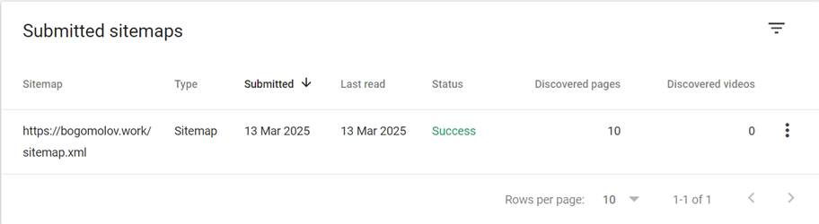
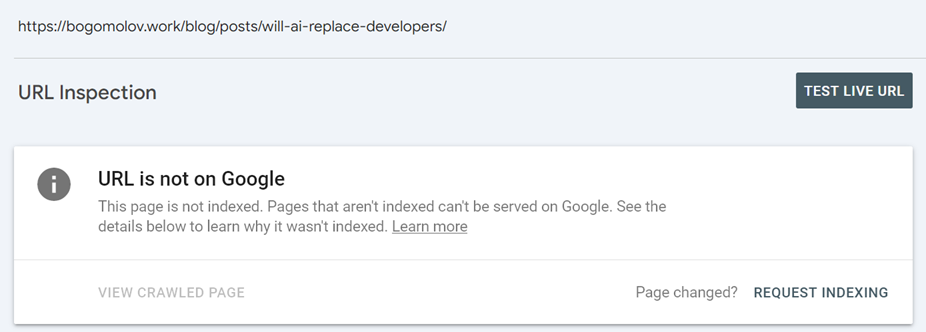
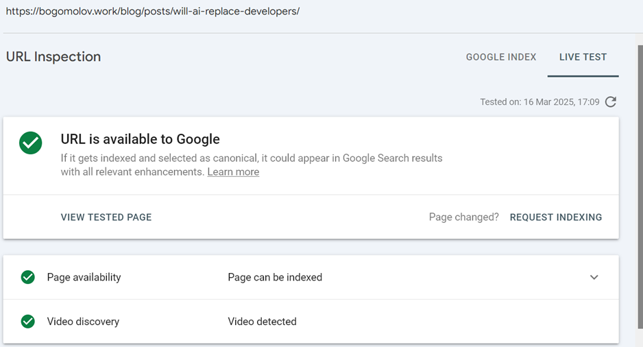
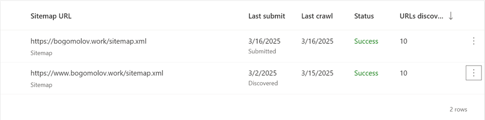
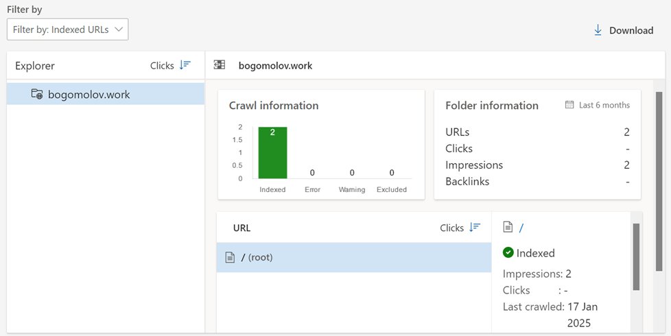
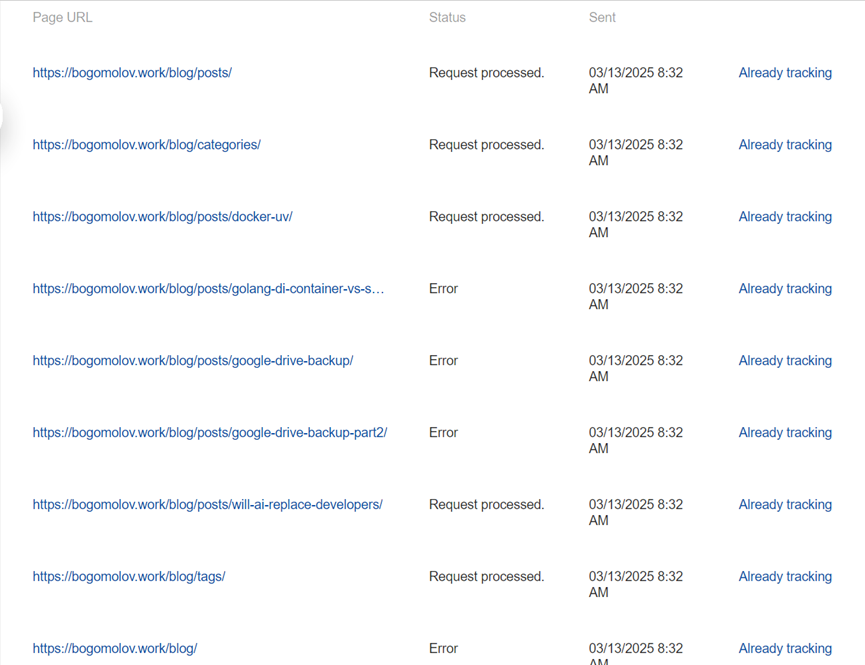

Search indexing is too flaky to bet a small site on. I spent about three months
with Google Search Console, Bing Webmaster Tools, and Yandex Webmaster. If this
reduces frustration for someone, good. If it saves time, better.


This continues an idea from a recent
[Telegram post](https://t.me/the_digital_lab/13). The site was new. The behavior
wasn't pretty.

## Who owns the search indexes

First, there aren't many independent indexes. Based on public info:

- google.com has its own index and resells it to:
  - startpage.com
  - ecosia.org
  - ...
- bing.com has its own index and resells it to:
  - yahoo.com
  - duckduckgo.com
  - ...
- ya.ru has its own index. I didn't find resale info
- baidu.com has its own index. I didn't find resale info
- Newer AI-powered search engines have not publicly shared their indexing
  information
  - perplexity.ai
  - chatgpt.com/?hints=search

In practice: if Bing caches my page wrong, fixing it is hard, and other search
engines may inherit the bad result.



1. Outdated DuckDuckGo result
   https://duckduckgo.com/?q=bogomolov+Software+engineer+Consultant:
   
1. Current Google result
   https://www.google.com/search?q=bogomolov+software+engineer+consultant:
   

That changed about a month ago and was still inconsistent. 

## Verify domain, submit sitemap

Even without verified ownership, search engines scraped the index page. Based on
my experience: only the index. No DFS. Probably no return visit to check
updates. Note to self.

To fix it, I went to:

- [Google search console](https://search.google.com/search-console)
- [Bing webmasters](https://www.bing.com/webmasters)
- [Yandex webmaster](https://webmaster.yandex.com)
- Omitting Baidu and AI-powered search engines this time

Then I proved site ownership. They provided different options; I chose domain
records for all of them.



```bash
$ dig bogomolov.work TXT
...

;; ANSWER SECTION:
...
bogomolov.work.         300     IN      TXT     "yandex-verification: 7417053df139a332"
```



The next step is a [sitemap.xml](/sitemap.xml) and, optionally,
[robots.txt](/robots.txt). The rest is engine-specific.

The problems start there.

## Google: sitemap is not enough

`sitemap.xml` provides the page list and update dates. Mine is generated and
validated by:

- Removing and then re-adding the sitemap helps to verify the number of indexed
  pages
- Yandex provides validator
- Other search engines

In my experience, the sitemap alone doesn't work. Sometimes direct URL
submission helps after several attempts and time. For example, [this
post]() from 2025-03-12
had to be submitted manually.


 amount of discovered
pages is rights, it contains new one, while
 testing live url
 shows that all right with it


Another issue: Google kept adding a nonexistent redirected page, then
highlighted it as not indexed.

And once more: their crawler crashed on my page and dropped it from the index.
Neither Bing nor Yandex had that issue. Validation took three days. Bad week if
that page is the main landing page.

## Bing: stale cache, ignored actions

Most confusing indexer. I would call it broken.

I ignore its suggestions about short page titles and descriptions.

 For example it
rejected to index [/blog](/blog/)-page, because it dislike title "_The
Archive_", to short, thats why I needs to implement workaround and appending
descriptions part if title too short. In addition to title and index, it shames
me for multiple `h1` on single page and I fixed it (but okay-okay, here it was
right). 

It ignores too many webmaster actions. At first, probably on domain
registration, it indexed the site. Later it detected a duplicate sitemap from
the CNAME'd _www_ subdomain.



And this is all it knows:



Manual page submission is limited to 10 per day. I exhausted that limit a few
times. Then it spent days showing "Not enough data" for almost every page. The
result of all that work: _outdated_ [**/**](/).

## Yandex: indexed, then called low-value

My simple metric: how many pages are available in the index:

| Query                                                             | Google | Bing | Yandex |
| :---------------------------------------------------------------- | :----: | :--: | :----: |
| Software engineer & Consultant site:bogomolov.work                |   ✅   |  ❌  |   ✅   |
| The Archive site:bogomolov.work                                   |   ❌   |  ❌  |   ❌   |
| Python3 Dockerfile with uv site:bogomolov.work                    |   ✅   |  ❌  |   ❌   |
| DI Container vs. Service Template (generator) site:bogomolov.work |   ✅   |  ❌  |   ❌   |
| (Almost) Free Google Drive Backup site:bogomolov.work             |   ❌   |  ❌  |   ❌   |
| Google Drive Backup Part 2 site:bogomolov.work                    |   ✅   |  ❌  |   ❌   |
| Will AI Replace Developers? site:bogomolov.work                   |   ❌   |  ❌  |   ❌   |
| Total                                                             |   4    |  0   |   1    |

Yandex has one more excuse. It sees both of these:

- [(Almost) Free Google Drive
  Backup]()
- [Google Drive Backup Part
  2]()

but excludes them from search due to its _Low-value or low-demand_ page
classification.



This and more unexplained problems still wait for me.

## Verdict: don't bet the business on search

If basic indexing is this unreliable, I can't trust search engines as the main
growth channel. AI search may change the game later. For now, search is too slow
and too opaque. I'll spend less time on SEO and more time on other organic
channels.
