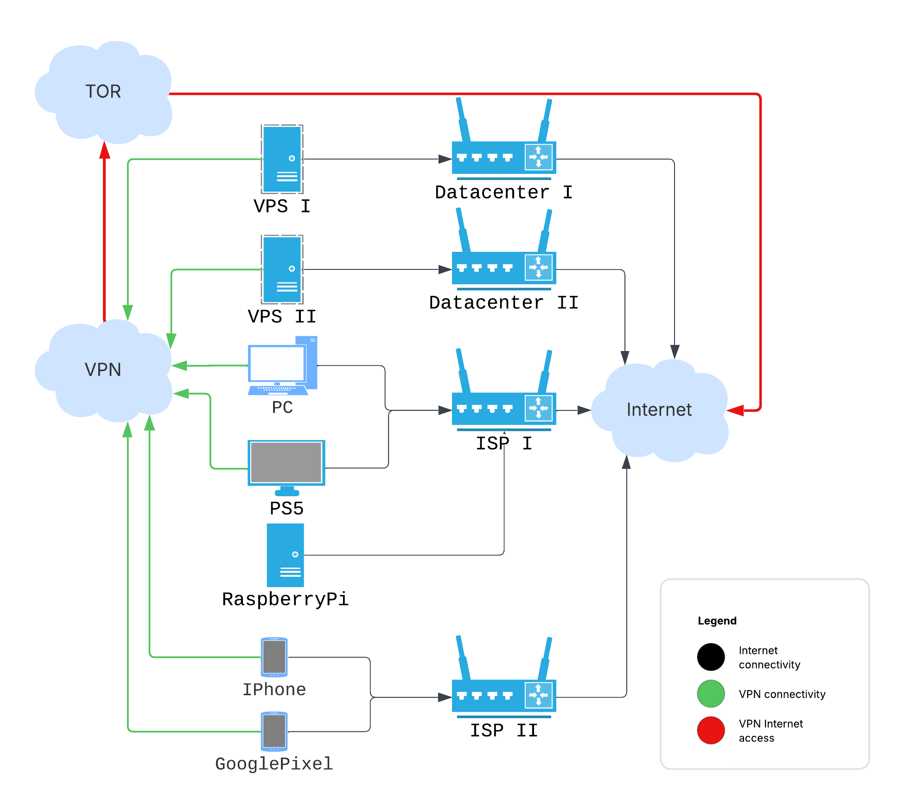

I started cleaning up my home infrastructure and tried to make Shadowsocks act
like a VPN. It failed in the parts I needed most.

My pile: a few VPSs from different hosts, a Raspberry Pi, a PlayStation, some
PCs, and phones. I want simple VPS monitoring, a Raspberry Pi dashboard, and a
safe way to deploy services. I also want traffic exit points in other regions
and IP ranges. Scheme below:



Because the setup crosses several ISPs, I want it reliable and private from each
provider. That's why I tried Shadowsocks, specifically `sslocal` in _TUN mode_,
as a VPN-like routed network. Shadowsocks is built for censorship resistance,
which overlaps with my needs. There isn't much written about this exact use, so
here is the failure log.

For those in a hurry, here are the prepared Ansible playbooks:
https://github.com/irr123/shadowsocks-to-tor

## Tor daemon

I started with the simplest part: setting up Tor. Tor needs no long intro; at
least the Tor Browser is familiar enough. In my case, I only needed to set up
the daemon (without the browser) and route the VPN's external traffic through
it. (Spoiler: this part works almost
[perfectly](#where-shadowsocks-failed-as-a-vpn)).

### Tor config

According to
[https://support.torproject.org/apt/tor-deb-repo/](https://support.torproject.org/apt/tor-deb-repo/),
after installing the necessary packages, the daemon starts automatically.

Before installation, I write the config to `/etc/tor/torrc`:

```txt
AutomapHostsOnResolve 1
AutomapHostsSuffixes .onion,.exit
AvoidDiskWrites 1
DNSPort 127.0.0.1:9053
TransPort 127.0.0.1:9040
SocksPort 127.0.0.1:9050
```

Checking:

```bash
torify curl https://check.torproject.org | grep "Congrat"
...
Congratulations. This browser is configured to use Tor.
```

Simple enough. Tor is mature enough that the default path didn't fight me.

## Shadowsocks

I use the Rust implementation. It has several components, and the docs make the
split harder to learn than it should be:

- **ssserver**: Actually a service that accepts client connections and forwards
  traffic externally.
- **sslocal**: A client, like the one found at
  https://github.com/shadowsocks/shadowsocks-windows/releases.
- **ssmanager**: A utility that allows for dynamic management of server
  instances and provides some observability statistics.
- **ssservice**: A unified entrypoint to manage all previous commands (_?_),
  plus a password generator.
- **ssurl**: A utility to generate links like
  _ss://ENCODED_CONFIG@SERVER_ADDRESS:SERVER_PORT_, which can then be encoded
  into a [QR-code]()
  and easily applied on a mobile phone, for example.

### Shadowsocks server config

The docs provide many
[installation options](https://github.com/shadowsocks/shadowsocks-rust#build--install),
from regular Linux repos and snaps to Docker images and self-built binaries. I
use pre-built binaries from the GitHub releases page. Same for service
lifecycle: systemd, supervisord, self-managed, Docker/k8s. I use systemd. Here
is the unit file at `/etc/systemd/system/shadowsocks-server.service`:

```ini
[Unit]
Description=Shadowsocks-rust Server Service
Documentation=https://github.com/shadowsocks/shadowsocks-rust
After=network.target network-online.target
Wants=network-online.target

[Service]
Type=simple
User=ssuser
Group=ssuser
ExecStart=/opt/shadowsocks/v1.23.4/ssserver -c /opt/shadowsocks/v1.23.4/config.json
WorkingDirectory=/opt/shadowsocks/v1.23.4
LimitNOFILE=51200
Restart=always
RestartSec=5s

[Install]
WantedBy=multi-user.target
```

An important part here is the dedicated user. Create it manually, as this user
will be referenced in the iptables rules implemented
[later](#connecting-shadowsocks-with-tor):

```bash
useradd --system --shell /usr/sbin/nologin --no-create-home ssuser
```

Additionally, I need `/opt/shadowsocks/v1.23.4/config.json` (exact locations are
my choice):

```json
{
  "server": "0.0.0.0",
  "server_port": 8388,
  "local_port": 1080,
  "password": "YOUR_GENERATED_PASSWORD_HERE",
  "method": "chacha20-ietf-poly1305",
  "mode": "tcp_and_udp"
}
```

First, generate the password by running (it's included with the shadowsocks-rust
binaries):

```bash
ssservice genkey --encrypt-method chacha20-ietf-poly1305
```

Then, copy the output and paste it as the value for the "password" field above.

Enable and start the service:

```bash
systemctl enable shadowsocks-server.service
systemctl start shadowsocks-server.service
```

After this, I can configure any client, like the Windows one I mentioned
[previously](#shadowsocks). It passes traffic through the set-up VPS. Configure
a local/global/PAC SOCKS5 proxy and try [myip.wtf](https://myip.wtf). With the
server set up like this, the next step is to route its outgoing traffic through
Tor.

Don't forget, all these parts are already automated by the Ansible playbook.

## Connecting Shadowsocks with Tor

Now I complete the setup by applying these iptables rules on the VPS running
ssserver and Tor:

```bash
# Create a new chain for Tor output
iptables -t nat -N TOR_OUTPUT || /bin/true

# Route all output from the 'ssuser' to our new TOR_OUTPUT chain
iptables -t nat -A OUTPUT -m owner --uid-owner ssuser -j TOR_OUTPUT

# Exclude private/reserved networks from Tor redirection (adjust as needed)
iptables -t nat -A TOR_OUTPUT -d 0.0.0.0/8 -j RETURN
iptables -t nat -A TOR_OUTPUT -d 10.0.0.0/8 -j RETURN
iptables -t nat -A TOR_OUTPUT -d 172.16.0.0/12 -j RETURN
iptables -t nat -A TOR_OUTPUT -d 192.168.0.0/16 -j RETURN
iptables -t nat -A TOR_OUTPUT -d 127.0.0.0/8 -j RETURN # Localhost traffic
iptables -t nat -A TOR_OUTPUT -d <VPS public address> -j RETURN # Traffic to VPS itself

# Redirect TCP traffic
iptables -t nat -A TOR_OUTPUT -p tcp -m tcp --syn -j REDIRECT --to-ports 9040

# Redirect DNS UDP
iptables -t nat -A TOR_OUTPUT -p udp --dport 53 -j REDIRECT --to-ports 9053

# Persist the rules
netfilter-persistent save
```

Now I recheck https://myip.wtf through the Shadowsocks client and should see an
IP address from the Tor network.

## Where Shadowsocks failed as a VPN

This can work for narrow cases. https://dnsleaktest.com showed no DNS leaks
through the Shadowsocks-Tor setup. WebRTC could still expose my real address.
Blocking all UDP might help, but I wasn't ready to do that.

Another disadvantage: this setup doesn't reliably resolve `.onion` addresses for
the end client, while on the VPS it works. On the client, it somehow fails. I
didn't dig deeply because a bigger issue blocked the setup.

Small, stupid papercut: the Shadowsocks icon for some clients looks too much
like the Telegram icon. Gets me every time.

And the most important issues for me:

1. **Inter-Client Connectivity**: The server provides problematic connectivity
   between clients set up in TUN mode. For example, in the Ansible playbook, I
   set up Linux clients in TUN mode in their own subnet (192.168.7.0/24). While
   ICMP (ping) worked between them, neither TCP nor UDP data packets were
   reliably passed end-to-end from one Shadowsocks client (e.g., my main server
   trying to reach another VPS also connected via sslocal) to another. TCP
   connections would appear to establish on the initiating client's TUN
   interface, but no actual data would reach the destination client.
2. **Client Limitations**: The standard Windows client (and many others) doesn't
   provide a system-wide VPN service; it's only a SOCKS5/HTTP proxy. This means
   that I can only access the internet through applications configured to use
   the proxy. There's no direct access to other devices in a private network
   (e.g., 192.168.7.x) if I'm trying to build one, nor does it tunnel all system
   traffic.

## Verdict: proxy works, VPN doesn't

Shadowsocks is good at its core job: bypassing DPI and proxying traffic. The
standard **ssserver** tool isn't built for a routed private network between all
clients. It's a secure proxy. I needed a VPN.

Or at least, I didn't find a solution using Shadowsocks alone to achieve all my
networking goals for this internal infrastructure. Reverting
[WireGuard]() 😌
