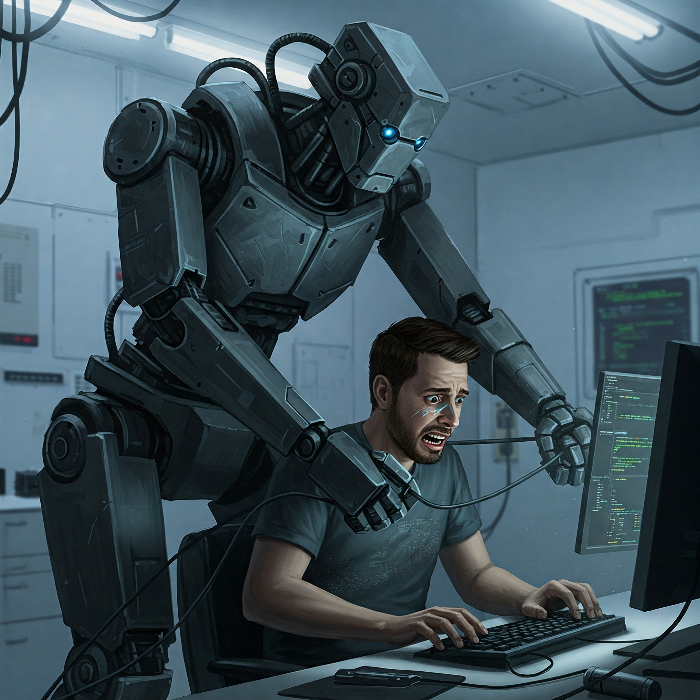
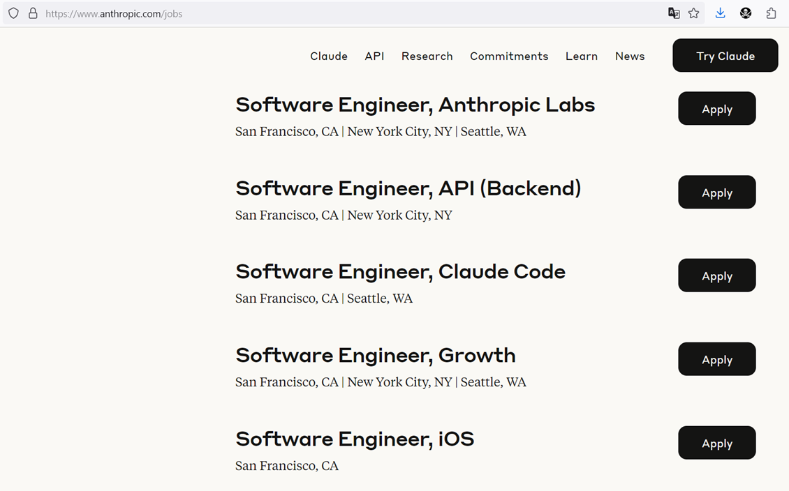

The public claim says AI will replace developers soon. The hiring page says the
opposite.

Here is a talk from Anthropic's CEO, published one day before this post:



Now check their [actual hiring plans](https://www.anthropic.com/jobs): Product,
Infra, and Data Science. Hiring for a senior or staff role takes six months or
more:

Around _150_ open roles against a team of about
[1000](https://grokipedia.com/page/Anthropic). That's not a company acting like
engineering headcount is over.

I draw my conclusion from the payroll 😉

P.S. Dario Amodei's final answer on what it means to be human is worth the time.
