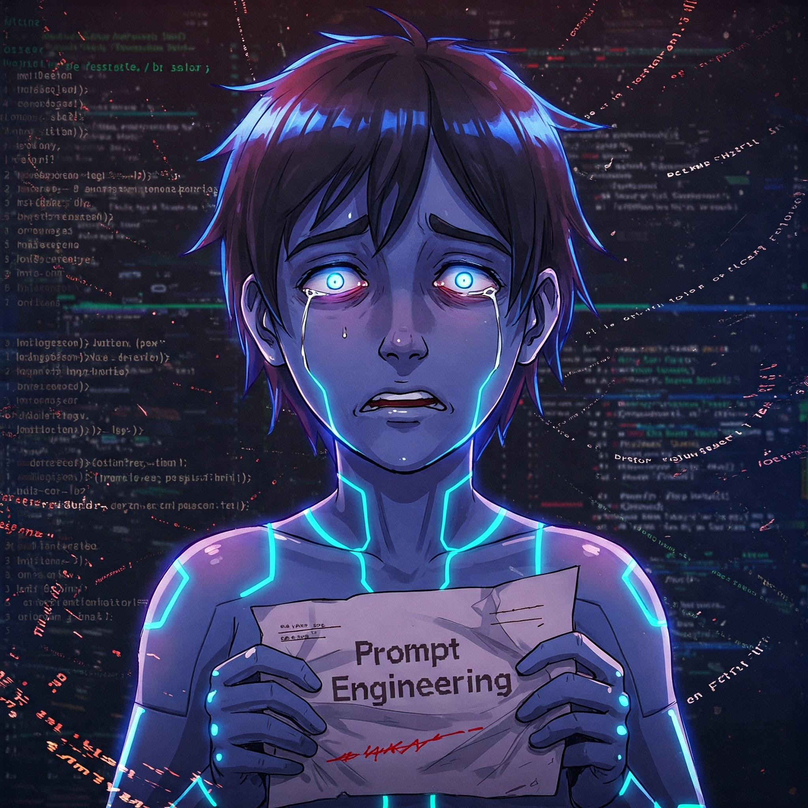
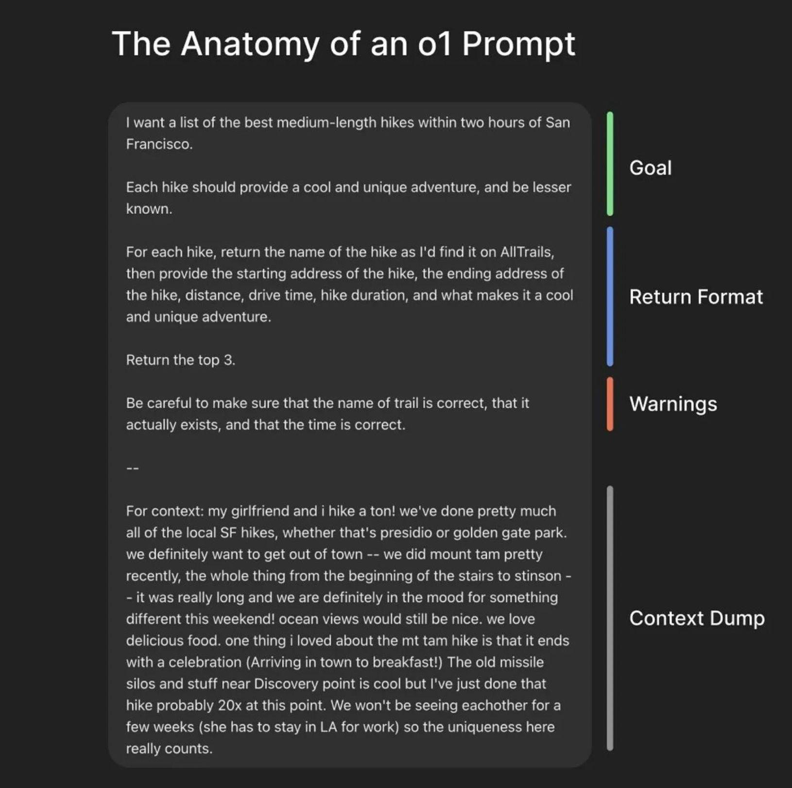

If you weren't aware, there was a leak of Cursor and some other
[prompts](https://github.com/x1xhlol/system-prompts-and-models-of-ai-tools). I'm
not here to evaluate the quality of prompts, but let's consider it as a state of
the art from experienced guys.

## First things first

It's always valuable to check official docs, such as:

- https://platform.openai.com/docs/guides/prompt-engineering
  - https://cookbook.openai.com/articles/related_resources
- https://ai.google.dev/gemini-api/docs/prompting-intro

While the documentation is extensive, it is preferable to rely on it rather than
controversial sources.



 

## Real life examples

But for now let's try to separate two goals:

1. Build production-ready prompt which will be executed by some software
2. Using AI in everyday life (for example all images here are AI-generated)

And focus on **2**. In my personal workflow, I typically ask something like:

> generate anime style image where AI fed up of prompt

No context, no examples, no additional instructions/restrictions. Will it work?
Yes. Will it fit into overall stylistic? Probably not.

How to improve it? Following OpenAI best practices:

> generate anime style image where AI fed up of prompt
>
> Context:
>
> - my blog is about ...
> - this blog post about ...
> - avoid smth
> - do additional

If we are talking about text result, probably you'll want to add:

> provide result in markdown(?) format
>
> example output: ...

A few iterations of clarifications, and you're great.

## AI prompts in production software

Take a look at leaked prompts from the header and imagine how much time and
energy was spent into it, having context from the OpenAI cookbook 🤯

## Lifehack

Anthropic, claude.ai author,
[provides](https://docs.anthropic.com/en/docs/build-with-claude/prompt-engineering/prompt-generator)
automated tool https://anthropic.com/metaprompt-notebook/ (which requires access
to their model and API key) to generate better prompt. And I'm here to argue
that it was born outdated.

**Alternative**: use any AI provider to generate a prompt for prompt by
providing _raw, unprepared context_, for example:

> build a prompt to
>
> generate anime style image where AI fed up of prompt
>
> `ctrl-C` + `ctrl-V` of raw index.html

The resulted prompt:

> Anime style image, depicting an AI as a young, humanoid character with glowing
> digital patterns on their skin. The AI's expression is one of extreme
> exasperation and frustration. They are surrounded by a chaotic whirlwind of
> HTML code snippets, specifically similar to the provided HTML document. The AI
> is holding a crumpled piece of paper with the text "Prompt Engineering"
> scribbled on it. Their eyes are wide and strained, and a single tear is
> rolling down their cheek. The background should be a blurred, abstract
> representation of a computer screen with scrolling text. Use vibrant,
> saturated colors and dynamic lines to convey the AI's overwhelmed and fed-up
> state. The style should be reminiscent of modern anime with a touch of
> cyberpunk aesthetic.

Execute the prompt and see resulted image on header.

## Conclusion

AI has already evolved enough to replace third-party apps/services for prompt
building, such as prompt engineers, a profession that emerged during the hype.
