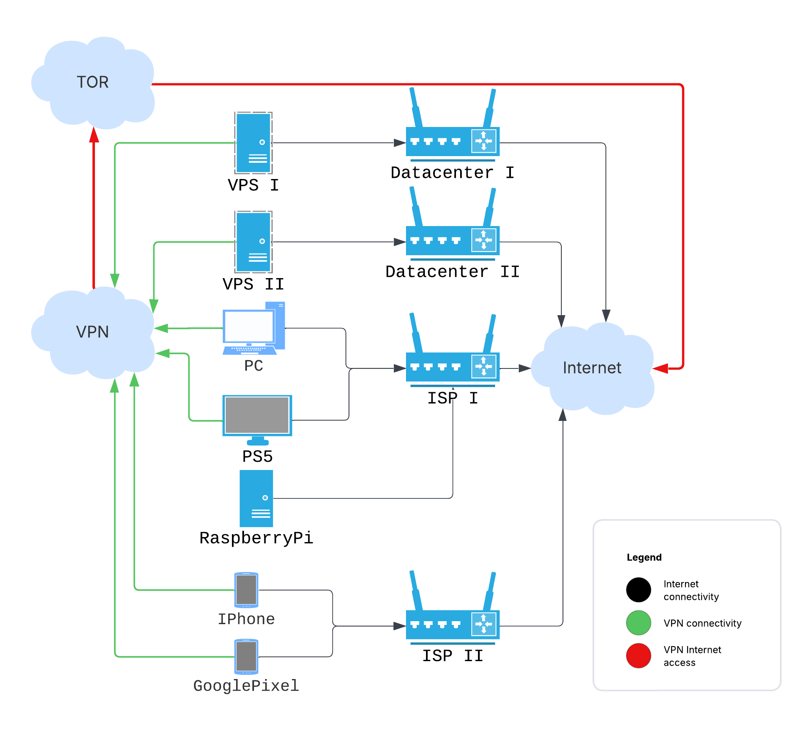

Well, the time has come, and I've decided to update, clean up, and generally
re-think my "home" infrastructure. This part is only about a (mostly _failed_)
networking setup.

What do I have and what do I want? I have a few virtual private servers (VPS)
from different hosting providers, a Raspberry Pi, a PlayStation, some PCs at
home, and mobile phones. The goal is to set up simple monitoring of the VPSs,
build a dashboard on the Raspberry Pi, and have the ability to deploy services
without constantly worrying about security. I also want to occasionally access
the internet from third-party regions and IP addresses, with the ability to add
more infrastructure without pain. Something similar to the scheme below:



And because it's a truly multi-tenant setup involving many different internet
service providers, I want to make it reliable and free from ISP spying. That's
why I explored using Shadowsocks (specifically `sslocal` in _TUN mode_) to
create a VPN-like routed network. A main selling point of Shadowsocks is its
ability to circumvent censorship, which aligns with my requirements. So, here's
the story (as there isn't much information available about Shadowsocks in this
particular action).

For those in a hurry, here are the prepared Ansible playbooks:
https://github.com/irr123/shadowsocks-to-tor

## Tor

I started with the simplest part – setting up Tor. I trust you've likely already
heard about Tor, at least the Tor Browser; if not, then take a look. In my case,
I only needed to set up the daemon (without the browser) and route the VPN's
external traffic through it. (Spoiler: this part works almost
[perfectly](#some-limitations-and-why-i-count-it-as-a-failed-setup)).

### Configuration

According to
[https://support.torproject.org/apt/tor-deb-repo/](https://support.torproject.org/apt/tor-deb-repo/),
you have to install the necessary packages, and the daemon will start
automatically.

Before installation, let's write the config to `/etc/tor/torrc`:

```txt
AutomapHostsOnResolve 1
AutomapHostsSuffixes .onion,.exit
AvoidDiskWrites 1
DNSPort 127.0.0.1:9053
TransPort 127.0.0.1:9040
SocksPort 127.0.0.1:9050
```

Checking:

```bash
torify curl https://check.torproject.org | grep "Congrat"
...
Congratulations. This browser is configured to use Tor.
```

Simple enough, Tor is too mature technology to introduce issues in default
configuration.

## Shadowsocks

I'm using the Rust implementation, which consists of several components (and
it's quite problematic to initially clarify what each of them is responsible
for, based on their docs):

- **ssserver**: Actually a service that accepts client connections and forwards
  traffic externally.
- **sslocal**: A client, like the one found at
  https://github.com/shadowsocks/shadowsocks-windows/releases.
- **ssmanager**: A utility that allows for dynamic management of server
  instances and provides some observability statistics.
- **ssservice**: A unified entrypoint to manage all previous commands (_?_),
  plus a password generator.
- **ssurl**: A utility to generate links like
  _ss://ENCODED_CONFIG@SERVER_ADDRESS:SERVER_PORT_, which can then be encoded
  into a [QR-code]() and
  easily applied on a mobile phone, for example.

### Configuration

The docs provide many different
[installation options](https://github.com/shadowsocks/shadowsocks-rust#build--install),
from regular Linux repos and snaps to Docker images and self-built binaries. I
decided to use pre-built binaries from github releases page. The same applies to
managing the service lifecycle – systemd, supervisord, self-managed, Docker/k8s;
systemd is my choice. Here's the systemd unit file at
`/etc/systemd/system/shadowsocks-server.service`:

```ini
[Unit]
Description=Shadowsocks-rust Server Service
Documentation=https://github.com/shadowsocks/shadowsocks-rust
After=network.target network-online.target
Wants=network-online.target

[Service]
Type=simple
User=ssuser
Group=ssuser
ExecStart=/opt/shadowsocks/v1.23.4/ssserver -c /opt/shadowsocks/v1.23.4/config.json
WorkingDirectory=/opt/shadowsocks/v1.23.4
LimitNOFILE=51200
Restart=always
RestartSec=5s

[Install]
WantedBy=multi-user.target
```

An important part here is the dedicated user. Create it manually, as this user
will be referenced in the iptables rules implemented
[later](#connecting-shadowsocks-with-tor):

```bash
useradd --system --shell /usr/sbin/nologin --no-create-home ssuser
```

Additionally, you will need `/opt/shadowsocks/v1.23.4/config.json` (the exact
locations are up to you):

```json
{
  "server": "0.0.0.0",
  "server_port": 8388,
  "local_port": 1080,
  "password": "YOUR_GENERATED_PASSWORD_HERE",
  "method": "chacha20-ietf-poly1305",
  "mode": "tcp_and_udp"
}
```

First, generate the password by running (it's included with the shadowsocks-rust
binaries):

```bash
ssservice genkey --encrypt-method chacha20-ietf-poly1305
```

Then, copy the output and paste it as the value for the "password" field above.

Enable and start the service; that's almost all:

```bash
systemctl enable shadowsocks-server.service
systemctl start shadowsocks-server.service
```

After this, you could configure any client, like the Windows one I mentioned
[previously](#shadowsocks). It will pass your traffic through the set-up VPS.
Configure a local/global/PAC SOCKS5 proxy and try [myip.wtf](https://myip.wtf).
With the server set up like this, the next step is to route its outgoing traffic
through Tor.

Don't forget, all these parts are already automated by the Ansible playbook.

## Connecting Shadowsocks with Tor

Now let's complete our setup by applying these iptables rules on the VPS running
ssserver and Tor:

```bash
# Create a new chain for Tor output
iptables -t nat -N TOR_OUTPUT || /bin/true

# Route all output from the 'ssuser' to our new TOR_OUTPUT chain
iptables -t nat -A OUTPUT -m owner --uid-owner ssuser -j TOR_OUTPUT

# Exclude private/reserved networks from Tor redirection (adjust as needed)
iptables -t nat -A TOR_OUTPUT -d 0.0.0.0/8 -j RETURN
iptables -t nat -A TOR_OUTPUT -d 10.0.0.0/8 -j RETURN
iptables -t nat -A TOR_OUTPUT -d 172.16.0.0/12 -j RETURN
iptables -t nat -A TOR_OUTPUT -d 192.168.0.0/16 -j RETURN
iptables -t nat -A TOR_OUTPUT -d 127.0.0.0/8 -j RETURN # Localhost traffic
iptables -t nat -A TOR_OUTPUT -d <VPS public address> -j RETURN # Traffic to VPS itself

# Redirect TCP traffic
iptables -t nat -A TOR_OUTPUT -p tcp -m tcp --syn -j REDIRECT --to-ports 9040

# Redirect DNS UDP
iptables -t nat -A TOR_OUTPUT -p udp --dport 53 -j REDIRECT --to-ports 9053

# Persist the rules
netfilter-persistent save
```

Now try to recheck https://myip.wtf through your Shadowsocks client, and you
should see an IP address from the Tor network.

## Some Limitations (and why I count it as a failed setup)

In general, this might be a good enough setup for particular cases. For example,
when checking https://dnsleaktest.com, DNS requests are not leaking through the
Shadowsocks-Tor setup. WebRTC, on the other hand, could expose your real
address; potential solutions might involve aggressive measures like blocking all
UDP traffic, which I wasn't prepared to do.

Another disadvantage – this setup doesn't reliably resolve `.onion` addresses
for the end client, while on the VPS it works. On the client, it somehow fails.
(I didn't dig too deeply into this because of a more significant issue for me).

Fun and less important, but confusing - the Shadowsocks icon for some clients is
too similar to the Telegram icon. Gets me every time.

And the most important issues for me:

1. **Inter-Client Connectivity**: The server provides problematic connectivity
   between clients set up in TUN mode. For example, in the Ansible playbook, I
   set up Linux clients in TUN mode in their own subnet (192.168.7.0/24). While
   ICMP (ping) worked between them, neither TCP nor UDP data packets were
   reliably passed end-to-end from one Shadowsocks client (e.g., my main server
   trying to reach another VPS also connected via sslocal) to another. TCP
   connections would appear to establish on the initiating client's TUN
   interface, but no actual data would reach the destination client.
2. **Client Limitations**: The standard Windows client (and many others) doesn't
   provide a system-wide VPN service; it's only a SOCKS5/HTTP proxy. This means
   that you can only access the internet through applications configured to use
   the proxy. There's no direct access to other devices in a private network
   (e.g., 192.168.7.x) if you're trying to build one, nor does it tunnel all
   system traffic.

## Conclusion

As I mentioned at the start, while the Shadowsocks protocol itself is likely
great for its core purpose (circumventing DPI and proxying traffic), the
standard **ssserver** tool isn't designed to build a fully-featured, routed
private network between all connected clients. It excels as a secure proxy, but
for creating a VPN where all devices can seamlessly communicate as if on a local
network, it falls short.

Or at least, I didn't find a solution using just Shadowsocks to achieve all my
networking goals for this internal infrastructure. Reverting WireGuard 😌
