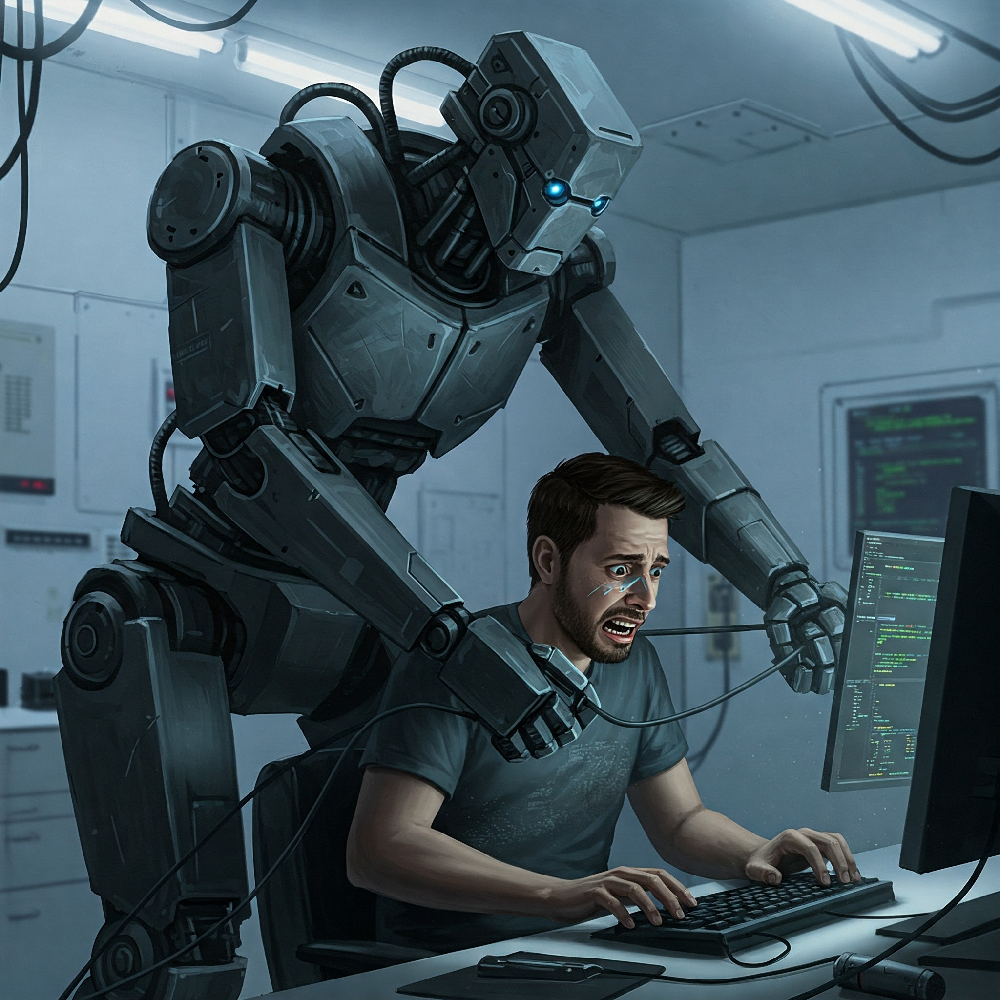

A common narrative from [OpenAI](https://openai.com/) and similar companies
(previous hype was from [no-code-guys](https://www.nocode.tech/)) suggests that
the era of human developers is ending due to cost considerations, and that AI
will replace programmers soon.

Check out this talk from the CEO of Anthropic, which occurred just one day
before this article:



And examine their [actual hiring plans](https://www.anthropic.com/jobs)
(Product, Infra, and Data Science). Notably, hiring for any senior or even staff
position takes six months or more:

With around _150_ open positions and a team of about
[700](https://en.wikipedia.org/wiki/Anthropic), looks like Anthropic is gearing
up for some serious growth, huh?

Draw your own conclusions 😉

P.S. Pay close attention to Dario Amodei's final answer regarding what it means
to be human. It's quite encouraging.
